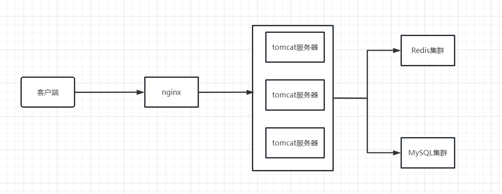

# 不俗气小众网名点评系统

#### 项目介绍
  不俗气小众网名点评系统是一款基于SpringBoot + MyBatisPlus + Redis + MySQL的本地生活信息及店铺点评APP，实现了找店铺=>写点评=>看热评=>点赞关注=>关注Feed流的完整业务流程

#### 项目功能
- 查看点评（热评）、发布点评、点赞
- 关注、查询关注的人发的点评、查看好友共同关注
- 分类浏览店铺、查看附近的店铺
- 商品下单以及优惠券秒杀
- 个人信息查看和管理

#### 软件架构

#### 技术栈
Spring相关：
- Spring Boot 2.x
- Spring MVC

数据存储层：
- MySQL：存储数据
- MyBatis Plus：数据访问框架

Redis相关：
- sping-data-redis：操作Redis
- Lettuce：操作Redis的高级客户端
- Apache Commons Pool：用于实现Redis连接池
- Redisson：基于Redis的分布式数据网络

工具库：
- HuTool：工具库合集
- Lombok：注解式代码生成工具

前端：
- 原生HTML、CSS、JS三件套
- Vue2
- Element UI组件库
- axios请求库

#### 代码
config目录：存放项目依赖相关配置
- MvcConfig：配置了登录，自动刷新登录Token的拦截器
- MybatisConfig：配置了MyBatis Plus分页插件
- RedissonConfig：创建单例Redission客户端
- WebExceptionAdice：全局响应拦截器

controller目录：存放Restful风格的API接口

dto目录：存放业务封装类，如Result通用响应封装

entity目录：存放和数据库对应的Java POJO

mapper目录：存放操作数据库的代码

service目录：存放业务逻辑处理代码

- BlogServiceImpl：基于Redis实现点赞、按时间排序的点赞排行榜；基于Redis实现推模式的Feed流
- FollowServiceImpl：基于Redis集合实现关注、共同关注
- ShopServiceImpl：基于Redis缓存优化店铺查询性能；基于Redis GEO实现附近店铺按距离排序
- UserServiceImpl：基于Redis实现短信登录（分布式Session）
- VoucherOrderServiceImpl：基于Redis分布式锁、Redis + Lua两种方式，结合消息队列，共同实现了秒杀和一人一单功能